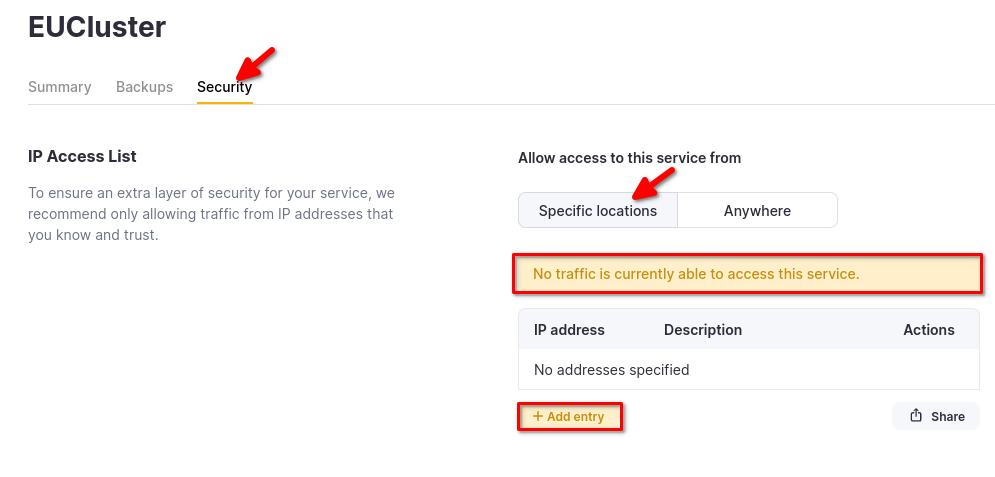
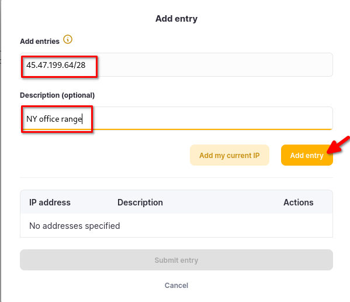

## Setup IP Access Lists

IP access lists filter traffic to your ClickHouse services by specifying which source addresses are permitted to connect to your ClickHouse service.  The lists are configurable for each service.  Lists can be configured during the deployment of a service, or afterward.  If you do not configure an IP access list during provisioning, or if you want to make changes to your initial list, then you can make those changes by selecting the service and then the **Security** tab.

:::important
If you skip the creation of the IP Access List for a ClickHouse Cloud service then no traffic will be permitted to the service.
:::

Before you begin, collect the IP Addresses or ranges that should be added to the access list.  Take into consideration remote workers, on-call locations, VPNs, etc.  The IP Access List user interface accepts individual addresses and CIDR notation.

Classless Inter-domain Routing (CIDR) notation, allows you to speciffy IP Address ranges smaller than the traditional Class A, B, or C (8, 6, or 24) subnet mask sizes. [ARIN](https://account.arin.net/public/cidrCalculator) and several other organizations provide CIDR calculators if you need one, and if you would like more information on CIDR notation, please see the [Classless Inter-domain Routing (CIDR)](https://www.rfc-editor.org/rfc/rfc4632.html) RFC.


<div class="row" style={{display: 'flex'}} >
  <div class="column" style={{flex: '30%', padding: '5px'}} >
  
  </div>
  <div class="column" style={{flex: '30%', padding: '5px'}} >
  
  </div>
</div>

Specify where your instance can be connected from.  There are two main choices: **Specific locations** and **Anywhere**.  Anywhere disables IP Filtering, so let's look at Specific Locations.  After selecting **Specific locations** you will notice that No traffic is currently able to access this service, and that you can add an entry.  Select **+ Add entry**.  

  

You can now add a range of addresses in Classless Inter-domain Routing (CIDR) notation, add the IP address that you are currently connecting from, or add a specific IP address.  [ARIN](https://account.arin.net/public/cidrCalculator) and several other organizations provide CIDR calculators if you need one, and if you would like more information on CIDR notation, please see the [Classless Inter-domain Routing (CIDR)](https://www.rfc-editor.org/rfc/rfc4632.html) RFC.



:::tip
Take into consideration all of the locations from which you may need to connect, including remote workers and VPNs.
:::

Once you create your filter confirm connectivity from within the range, and confirm that connections from outside the permitted range are denied.  A simple `curl` command can be used to verify:
```bash title="Attempt rejected from outside the allow list"
curl https://<HOSTNAME>.clickhouse.cloud:8443
```
```response
curl: (52) Empty reply from server
```
```bash title="Attempt permitted from inside the allow list"
curl https://<HOSTNAME>.clickhouse.cloud:8443
```
```response
Ok.
```

After your service is provisioned you can change the filter from the service overview > Security tab.
