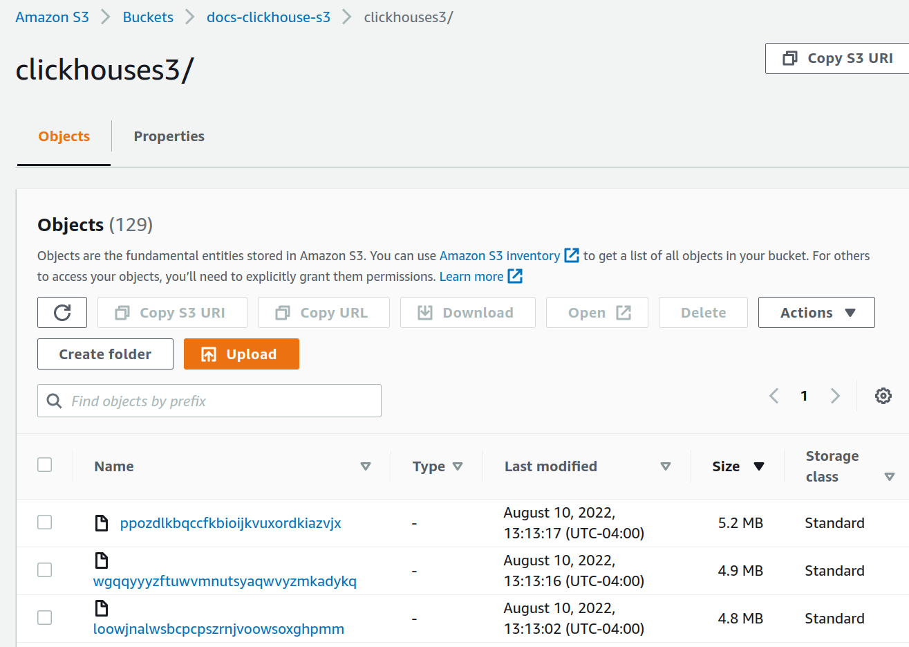
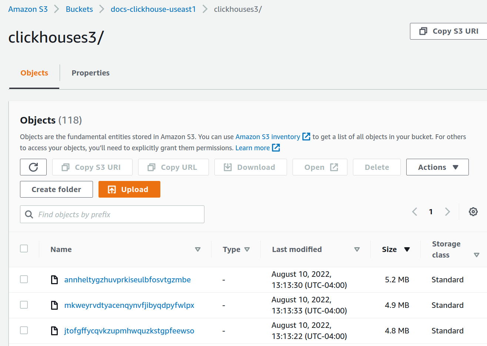

# Replicating a single shard across two AWS regions using S3 Object Storage

- [Plan the deployment](#plan-the-deployment)
- [Install software](#install-software)
- [Create S3 Buckets](#create-s3-buckets)
- [Configure ClickHouse Keeper](#configure-clickhouse-keeper)
- [Configure ClickHouse server](#configure-clickhouse-server)
- [Configure networking](#configure-networking)
- [Start the servers](#start-the-servers)
- [Testing](#testing)

## Plan the deployment
This tutorial is based on deploying two ClickHouse Server nodes and three ClickHouse Keeper nodes in AWS EC2.  The data store for the ClickHouse servers is S3. Two AWS regions, with a ClickHouse Server and an S3 Bucket in each region, are used in order to support disaster recovery.

ClickHouse tables are replicated across the two servers, and therefore across the two regions.

## Install software

Refer to the [installation instructions](../../../en/getting-started/install/) when performing the deployment steps.  The same instructions are used for ClickHouse Server and ClickHouse Keeper.

### Deploy ClickHouse

Deploy ClickHouse on two hosts, in the sample configurations these are named `chnode1`, `chnode2`.

Place `chnode1` in one AWS region, and `chnode2` in a second.

### Deploy ClickHouse Keeper

Deploy ClickHouse Keeper on three hosts, in the sample configurations these are named `keepernode1`, `keepernode2`, and `keepernode3`.  `keepernode1` can be deployed in the same region as `chnode1`, `keepernode2` with `chnode2`, and `keepernode3` in either region but a different availability zone from the ClickHouse node in that region.

:::note
ClickHouse Keeper is installed the same way as ClickHouse, as it can be run with ClickHouse server, or standalone.  Running Keeper standalone gives more flexibility when scaling out or upgrading.
:::

Once you deploy ClickHouse on the three Keeper nodes run these commands to prep the directories for configuration and operation in standalone mode:

```bash
sudo mkdir /etc/clickhouse-keeper
sudo chown clickhouse:clickhouse /etc/clickhouse-keeper
chmod 700 /etc/clickhouse-keeper
sudo mkdir -p /var/lib/clickhouse/coordination
sudo chown -R clickhouse:clickhouse /var/lib/clickhouse
```

## Create S3 Buckets

Creating S3 buckets is covered in the guide [use S3 Object Storage as a ClickHouse disk](./configuring-s3-for-clickhouse-use.md). Create two S3 buckets, one in each of the regions that you have placed `chnode1` and `chnode2`.  The configuration files will then be placed in `/etc/clickhouse-server/config.d/`.  Here is a sample configuration file for one bucket, the other is similar with the three highlighted lines differing:

```xml title="/etc/clickhouse-server/config.d/storage_config.xml"
<clickhouse>
  <storage_configuration>
     <disks>
        <s3_disk>
           <type>s3</type>
	<!--highlight-start-->
           <endpoint>https://docs-clickhouse-s3.s3.us-east-2.amazonaws.com/clickhouses3/</endpoint>
           <access_key_id>ABCDEFGHIJKLMNOPQRST</access_key_id>
           <secret_access_key>Tjdm4kf5snfkj303nfljnev79wkjn2l3knr81007</secret_access_key>
	<!--highlight-end-->
           <metadata_path>/var/lib/clickhouse/disks/s3_disk/</metadata_path>
           <cache_enabled>true</cache_enabled>
           <data_cache_enabled>true</data_cache_enabled>
           <cache_path>/var/lib/clickhouse/disks/s3_disk/cache/</cache_path>
         </s3_disk>
     </disks>
        <policies>
            <s3_main>
                <volumes>
                    <main>
                        <disk>s3_disk</disk>
                    </main>
                </volumes>
            </s3_main>
    </policies>
   </storage_configuration>
</clickhouse>
```
:::note
Many of the steps in this guide will ask you to place a configuration file in `/etc/clickhouse-server/config.d/`.  This is the default location on Linux systems for configuration override files.  When you put these files into that directory ClickHouse will use the content to override the default configuration.  By placing these files in the override directory you will avoid losing your configuration during an upgrade.
:::

## Configure ClickHouse Keeper

When running ClickHouse Keeper standalone (separate from ClickHouse server) the configuration is a single XML file.  In this tutorial, the file is `/etc/clickhouse-keeper/keeper.xml`.  All three Keeper servers use the same configuration with one setting different; `<server_id>`.

`server_id` indicates the ID to be assigned to the host where the configuration files is used.  In the example below, the `server_id` is `3`, and if you look further down in the file in the `<raft_configuration>` section, you will see that server 3 has the hostname `keepernode3`.  This is how the ClickHouse Keeper process knows which other servers to connect to when choosing a leader and all other activities.

```xml title="/etc/clickhouse-keeper/keeper.xml"
<clickhouse>
    <listen_host>0.0.0.0</listen_host>

    <keeper_server>
        <tcp_port>9181</tcp_port>
	<!--highlight-start-->
        <server_id>3</server_id>
	<!--highlight-end-->
        <log_storage_path>/var/lib/clickhouse/coordination/log</log_storage_path>
        <snapshot_storage_path>/var/lib/clickhouse/coordination/snapshots</snapshot_storage_path>

        <coordination_settings>
            <operation_timeout_ms>10000</operation_timeout_ms>
            <session_timeout_ms>30000</session_timeout_ms>
            <raft_logs_level>warning</raft_logs_level>
        </coordination_settings>

        <raft_configuration>
            <server>
                <id>1</id>
                <hostname>keepernode1</hostname>
                <port>9444</port>
            </server>
            <server>
                <id>2</id>
                <hostname>keepernode2</hostname>
                <port>9444</port>
            </server>
	<!--highlight-start-->
            <server>
                <id>3</id>
                <hostname>keepernode3</hostname>
	<!--highlight-end-->
                <port>9444</port>
            </server>
        </raft_configuration>
    </keeper_server>
</clickhouse>
```

Copy the configuration file for ClickHouse Keeper in place (remembering to set the `<server_id>`): 
```bash
sudo -u clickhouse \
  cp keeper.xml /etc/clickhouse-keeper/keeper.xml
```

## Configure ClickHouse Server

### Define a cluster

ClickHouse cluster(s) are defined in the `<remote_servers>` section of the configuration.  In this sample one cluster, `cluster_1S_2R`, is defined and it consists of a single shard with two replicas.  The replicas are located on the hosts `chnode1` and `chnode2`.

```xml title="/etc/clickhouse-server/config.d/remote-servers.xml"
<clickhouse>
    <remote_servers replace="true">
        <cluster_1S_2R>
            <shard>
                <replica>
                    <host>chnode1</host>
                    <port>9000</port>
                </replica>
                <replica>
                    <host>chnode2</host>
                    <port>9000</port>
                </replica>
            </shard>
        </cluster_1S_2R>
    </remote_servers>
</clickhouse>
```

When working with clusters it is handy to define macros that populate DDL queries with the cluster, shard, and replica settings.  This sample allows you to specify the use of a replicated table engine without proving the details.

```xml title="/etc/clickhouse-server/config.d/macros.xml"
<clickhouse>
    <distributed_ddl>
            <path>/clickhouse/task_queue/ddl</path>
    </distributed_ddl>
    <macros>
        <cluster>cluster_1S_2R</cluster>
        <shard>1</shard>
        <replica>replica_1</replica>
    </macros>
</clickhouse>
```
:::note
The above macros are for `chnode1`, on `chnode2` set `shard` to `2`, and `replica` to `replica_2`.
:::

### Configure metadata replication

ClickHouse supports zero-copy replication for S3 and HDFS disks, which means that if the data is stored remotely on several machines and needs to be synchronized, then only the metadata is replicated (paths to the data parts), but not the data itself.  As disaster recovery is the goal in this scenario, both the data and metadata are replicated by overriding the default and setting `allow_remote_fs_zero_copy_replication` to `false`.
```xml title="/etc/clickhouse-server/config.d/remote-servers.xml"
<clickhouse>
   <merge_tree>
        <allow_remote_fs_zero_copy_replication>false</allow_remote_fs_zero_copy_replication>
   </merge_tree>
</clickhouse>
```


ClickHouse Keeper is responsible for coordinating the replication of data across the ClickHouse nodes.  To inform ClickHouse about the ClickHouse Keeper nodes add a configuration file to each of the ClickHouse nodes.

```xml title="/etc/clickhouse-server/config.d/use_keeper.xml"
<clickhouse>
    <zookeeper>
        <node index="1">
            <host>keepernode1</host>
            <port>9181</port>
        </node>
        <node index="2">
            <host>keepernode2</host>
            <port>9181</port>
        </node>
        <node index="3">
            <host>keepernode3</host>
            <port>9181</port>
        </node>
    </zookeeper>
</clickhouse>
```

## Configure networking

See the [network ports](./network-ports) list when you configure the security settings in AWS so that your servers can communicate with each other, and you can communicate with them.

All three servers must listen for network connections so that they can communicate between the servers and with S3.  By default, ClickHouse listens ony on the loopback address, so this must be changed.  This is configured in `/etc/clickhouse-server/config.d/`.  Here is a sample that configures ClickHouse and ClickHouse Keeper to listen on all IP v4 interfaces.  see the documentation or the default configuration file `/etc/clickhouse/config.xml` for more information.

```xml title="/etc/clickhouse-server/config.d/networking.xml"
<clickhouse>
    <listen_host>0.0.0.0</listen_host>
</clickhouse>
```

## Start the servers

### Run ClickHouse Keeper

On each Keeper server:
```bash
sudo -u clickhouse \
  clickhouse-keeper -C /etc/clickhouse-keeper/keeper.xml
```

#### Check ClickHouse Keeper status

Send commands to the ClickHouse Keeper with `netcat`.  For example, `mntr`:

```bash
echo mntr | nc localhost 9181
```
```response
zk_version	v22.7.2.15-stable-f843089624e8dd3ff7927b8a125cf3a7a769c069
zk_avg_latency	0
zk_max_latency	11
zk_min_latency	0
zk_packets_received	1783
zk_packets_sent	1783
# highlight-start
zk_num_alive_connections	2
zk_outstanding_requests	0
zk_server_state	leader
# highlight-end
zk_znode_count	135
zk_watch_count	8
zk_ephemerals_count	3
zk_approximate_data_size	42533
zk_key_arena_size	28672
zk_latest_snapshot_size	0
zk_open_file_descriptor_count	182
zk_max_file_descriptor_count	18446744073709551615
# highlight-start
zk_followers	2
zk_synced_followers	2
# highlight-end
```

### Run ClickHouse Server

On each ClickHouse server run
```
sudo service clickhouse-server start
```

#### Verify ClickHouse Server

When you added the [cluster configuration](#define-a-cluster) a single shard replicated across the two ClickHouse nodes was defined.  In this verification step you will check that the cluster was built when ClickHouse was started, and you will create a replicated table using that cluster.
- Verify that the cluster exists:
  ```sql
  show clusters
  ```
  ```response
  ┌─cluster───────┐
  │ cluster_1S_2R │
  └───────────────┘
  
  1 row in set. Elapsed: 0.009 sec. `
  ```

- Create a table in the cluster using the `ReplicatedMergeTree` table engine:
  ```sql
  create table trips on cluster 'cluster_1S_2R' (   
   `trip_id` UInt32,   
   `pickup_date` Date,   
   `pickup_datetime` DateTime,   
   `dropoff_datetime` DateTime,   
   `pickup_longitude` Float64,   
   `pickup_latitude` Float64,   
   `dropoff_longitude` Float64,   
   `dropoff_latitude` Float64,   
   `passenger_count` UInt8,   
   `trip_distance` Float64,   
   `tip_amount` Float32,   
   `total_amount` Float32,   
   `payment_type` Enum8('UNK' = 0, 'CSH' = 1, 'CRE' = 2, 'NOC' = 3, 'DIS' = 4))
  ENGINE = ReplicatedMergeTree
  PARTITION BY toYYYYMM(pickup_date)
  ORDER BY pickup_datetime
  SETTINGS index_granularity = 8192, storage_policy='s3_main'
  ```
  ```response
  ┌─host────┬─port─┬─status─┬─error─┬─num_hosts_remaining─┬─num_hosts_active─┐
  │ chnode1 │ 9000 │      0 │       │                   1 │                0 │
  │ chnode2 │ 9000 │      0 │       │                   0 │                0 │
  └─────────┴──────┴────────┴───────┴─────────────────────┴──────────────────┘
  ```

## Testing

These tests will verify that data is being replicated across the two servers, and that it is stored in the S3 Buckets and not on local disk.

- Add data from the New York City taxi dataset:
  ```sql
  INSERT INTO trips
  SELECT trip_id,
         pickup_date,
         pickup_datetime,
         dropoff_datetime,
         pickup_longitude,
         pickup_latitude,
         dropoff_longitude,
         dropoff_latitude,
         passenger_count,
         trip_distance,
         tip_amount,
         total_amount,
         payment_type
     FROM s3('https://ch-nyc-taxi.s3.eu-west-3.amazonaws.com/tsv/trips_{0..9}.tsv.gz', 'TabSeparatedWithNames') LIMIT 1000000;
  ```
- Verify that data is stored in S3.

  This query shows the size of the data on disk, and the policy used to determine which disk is used.
  ```sql
  SELECT
      engine,
      data_paths,
      metadata_path,
      storage_policy,
      formatReadableSize(total_bytes)
  FROM system.tables
  WHERE name = 'trips'
  FORMAT Vertical
  ```
  ```response
  Query id: af7a3d1b-7730-49e0-9314-cc51c4cf053c

  Row 1:
  ──────
  engine:                          ReplicatedMergeTree
  data_paths:                      ['/var/lib/clickhouse/disks/s3_disk/store/551/551a859d-ec2d-4512-9554-3a4e60782853/']
  metadata_path:                   /var/lib/clickhouse/store/e18/e18d3538-4c43-43d9-b083-4d8e0f390cf7/trips.sql
  storage_policy:                  s3_main
  formatReadableSize(total_bytes): 36.42 MiB

  1 row in set. Elapsed: 0.009 sec.
  ```

  Check the size of data on the local disk.  From above, the size on disk for the millions of rows stored is 36.42 MiB.  This should be on S3, and not the local disk.  The query above also tells us where on local disk data and metadata is stored.  Check the local data:
  ```response
  root@chnode1:~# du -sh /var/lib/clickhouse/disks/s3_disk/store/551
  536K	/var/lib/clickhouse/disks/s3_disk/store/551
  ```

  Check the S3 data in each S3 Bucket (the totals are not shown, but both buckets have approximately 36 MiB stored after the inserts):

  

  

