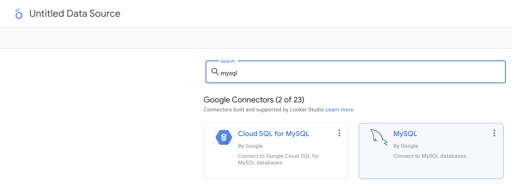
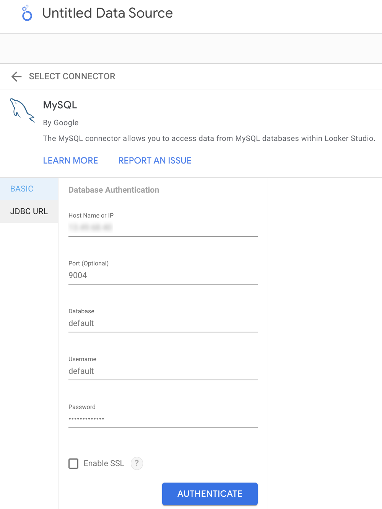
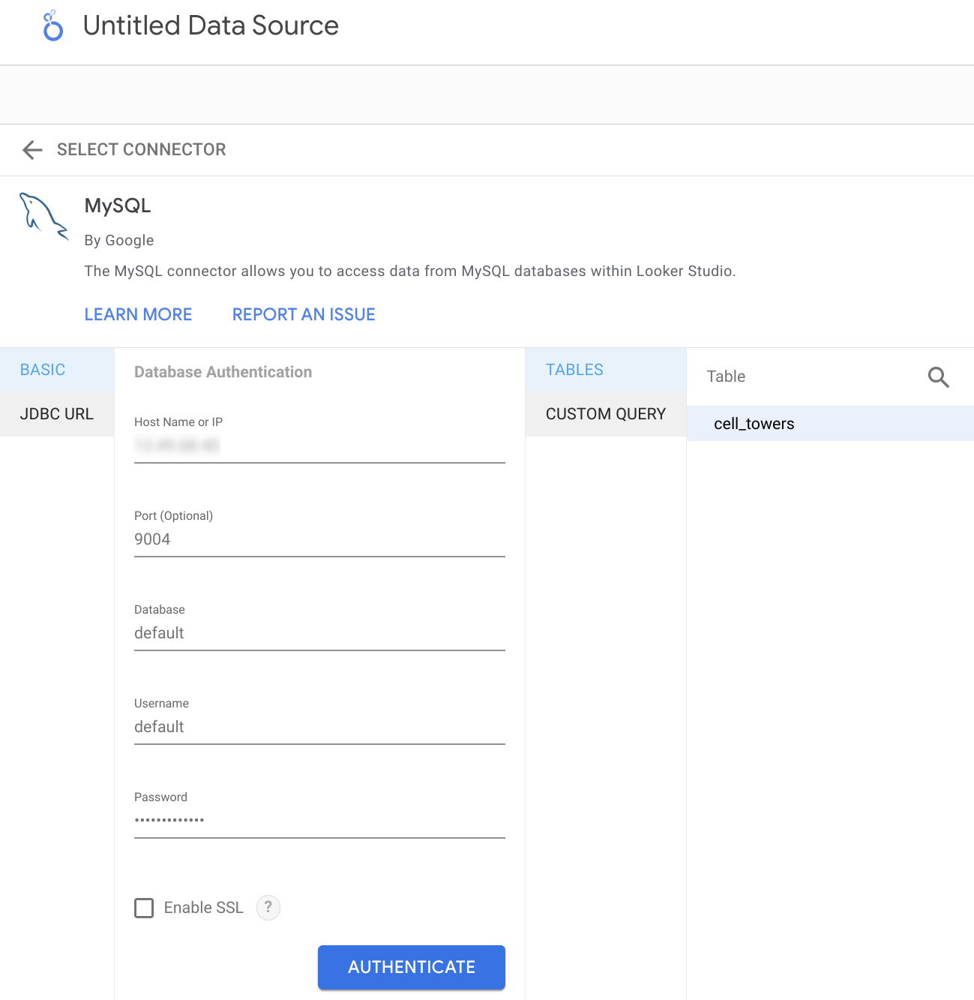
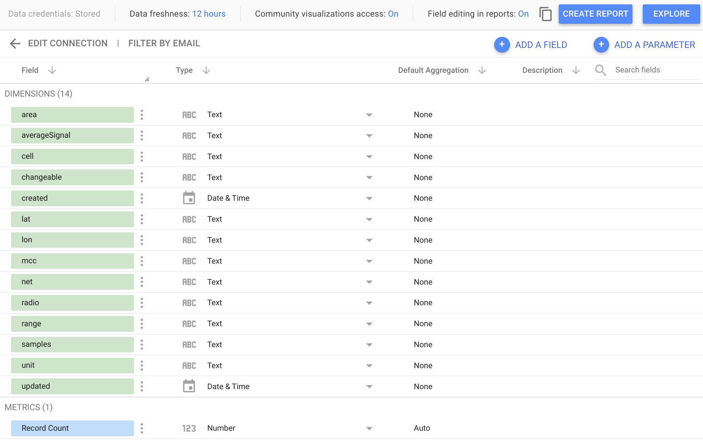

## Looker Studio

Looker Studio can connect to on-premise ClickHouse 23.4+ via MySQL interface using the official Google MySQL data source. 
Currently, it is not possible to connect Looker Studio to ClickHouse Cloud.

## On-premise ClickHouse server setup

Please refer to [the official documentation](https://clickhouse.com/docs/en/interfaces/mysql) 
on how to set up a ClickHouse server with enabled MySQL interface.

Aside from adding an entry to the server's `config.xml`

```xml
<clickhouse>
    <mysql_port>9004</mysql_port>
</clickhouse>
```

it is also _required_ to use 
[Double SHA1 password encryption](https://clickhouse.com/docs/en/operations/settings/settings-users#user-namepassword) 
for the user that will be using MySQL interface. 

Generating a random password encrypted with Double SHA1 from the shell:

```shell
PASSWORD=$(base64 < /dev/urandom | head -c16); echo "$PASSWORD"; echo -n "$PASSWORD" | sha1sum | tr -d '-' | xxd -r -p | sha1sum | tr -d '-'
```

The output should look like the following:

```
LZOQYnqQN4L/T6L0
fbc958cc745a82188a51f30de69eebfc67c40ee4
```

The first line is the generated password, and the second line is the hash we could use to configure ClickHouse.

Here is an example configuration for `mysql_user` that uses the generated hash:

* `/etc/clickhouse-server/users.xml`
```xml
  <users>
    <mysql_user>
        <password></password>
        <networks>
            <ip>::/0</ip>
        </networks>
        <profile>default</profile>
        <quota>default</quota>
    </mysql_user>
</users> 
```

NB: the password for `mysql_user` is empty in `users.xml`, and it will be overridden by `default-password.xml`.

* `/etc/clickhouse-server/users.d/default-password.xml`

```xml
<clickhouse>
    <users>
        <mysql_user>
            <password remove='1' />
            <password_double_sha1_hex>fbc958cc745a82188a51f30de69eebfc67c40ee4</password_double_sha1_hex>
        </mysql_user>
    </users>
</clickhouse>
```

NB: please replace `password_double_sha1_hex` entry with your own generated Double SHA1 hash.

Once the configuration is done, Looker Studio should be able to connect to ClickHouse via MySQL interface. 

## Connecting Looker Studio to ClickHouse

First of all, login to https://lookerstudio.google.com using your Google account and create a new Data Source:


  
Search for the official MySQL connector provided by Google (named just **MySQL**):


  
Specify your connection details. Please note that MySQL interface port is 9004 by default, 
and it might be different depending on your server configuration.



Now, you have two options on how to fetch the data from ClickHouse. First, you could use the Table Browser feature:


  
Alternatively, you could specify a custom query to fetch your data:


Finally, you should be able to see the introspected table structure and adjust the data types if necessary. 



Now you can proceed with exploring your data or creating a new report! 