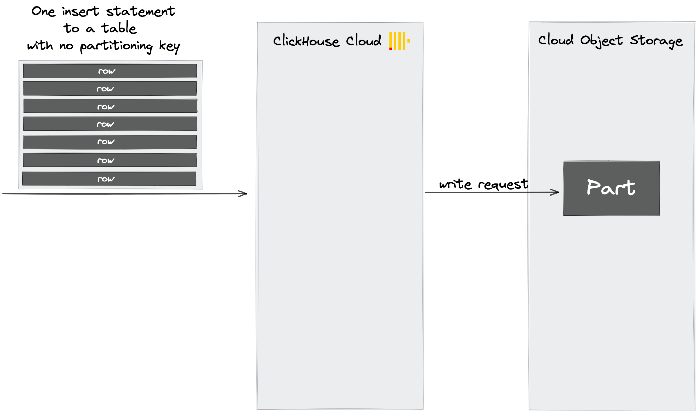
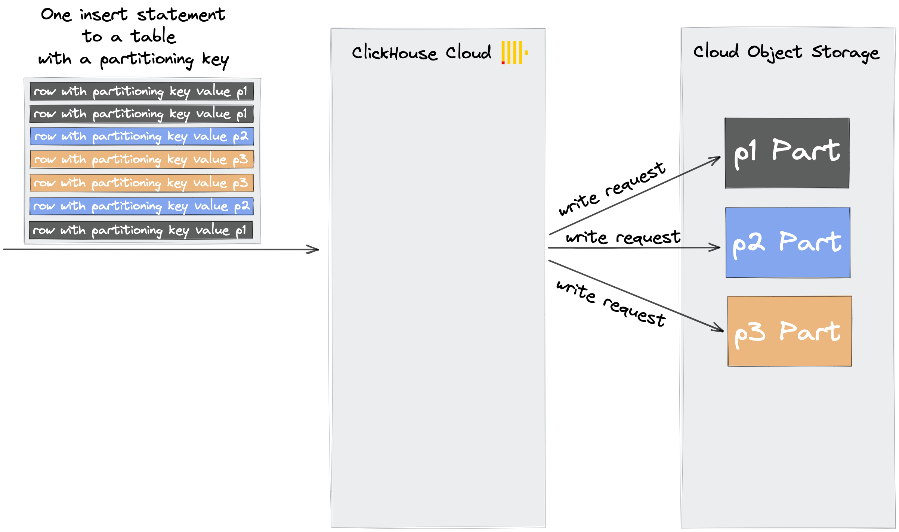

ClickHouse Cloud is using cloud object storage for your data. Write requests to object storage are more expensive than read requests. Here are some tips for minimizing the amount of write requests in ClickHouse Cloud.

## Ingest data in bulk
By default, each insert sent to ClickHouse causes ClickHouse to immediately create a part on storage containing the data from the insert together with other metadata that needs to be stored.
Therefore sending a smaller amount of inserts that each contain more data, compared to sending a larger amount of inserts that each contain less data, will reduce the number of writes required. Generally, we recommend inserting data in fairly large batches of at least 1,000 rows at a time, and ideally between 10,000 to 100,000 rows. To achieve this, consider implementing a buffer mechanism such as using Kafka in your application to enable batch inserts, or use asynchronous inserts (see [next section](#use-asynchronous-inserts)).

:::tip
Regardless of the size of your inserts, we recommend to keep the number of insert queries around one insert query per second. 
The reason for that recommendation is that the created parts are merged to larger parts in the background (in order to optimize your data for read queries), and sending too many insert queries per second can lead to situations where the background merging can't keep up with the amount of new parts.
However, you can use a higher rate of insert queries per second when you use asynchronous inserts (see [next section](#use-asynchronous-inserts)).
:::

## Use asynchronous inserts 

Use [asynchronous inserts](https://clickhouse.com/blog/click-house-v2111-released) as an alternative to both batching data on the client-side and keeping the insert rate at around one insert query per second by enabling the [async_insert](../operations/settings/settings/#async-insert) setting. This causes ClickHouse to handle the batching on the server-side. Doing so will therefore reduce the number of write requests generated.

As mentioned in the previous section, by default, ClickHouse is writing data synchronously.
Each insert sent to ClickHouse causes ClickHouse to immediately create a part containing the data from the insert. 
This is the default behavior when the async_insert setting is set to its default value of 0:


By setting async_insert to 1, ClickHouse first stores the incoming inserts into an in-memory buffer before flushing them regularly to disk. This asynchronous behavior allows ClickHouse to automatically batch your data up to 100KB (configurable via [async_insert_max_data_size](../operations/settings/settings/#async-insert-max-data-size)) or wait for 200ms (since the first insert) (configurable via [async_insert_busy_timeout_ms](../operations/settings/settings/#async-insert-max-data-size)) before writing the data to a new part in the object storage. This helps to reduce the amount of write requests for frequent inserts.

:::note
Your data is available for read queries once the data is written to a part on storage.
Keep that in mind, when you want to modify the async_insert_busy_timeout_ms (default value:  200ms) or the async_insert_max_data_size (default value: 100KB) settings.
:::


With the [wait_for_async_insert](../operations/settings/settings/#wait-for-async-insert) setting, you can configure if you want an insert statement to return with an acknowledgment either immediately after the data got inserted into the buffer (wait_for_async_insert = 0) or by default, after the data got written to a part after flushing from buffer (wait_for_async_insert = 1). 

The following two diagrams illustrate the two settings for async_insert and wait_for_async_insert:


You can specify the asynchronous insert settings by using the SETTINGS clause of insert queries:
```sql
INSERT INTO YourTable SETTINGS async_insert=1, wait_for_async_insert=0 VALUES (...)
```

You can also specify asynchronous insert settings as connection parameters when using a ClickHouse programming language client.
As an example, this is how you can do that within a JDBC connection string when you use the ClickHouse Java JDBC driver for connecting to ClickHouse Cloud :
```bash
"jdbc:ch://HOST.clickhouse.cloud:8443/?user=default&password=PASSWORD&ssl=true&custom_http_params=async_insert=1,wait_for_async_insert=0"
```


:::note Automatic deduplication is disabled when using asynchronous inserts
Manual batching (see [section above](#ingest-data-in-bulk))) has the advantage that it supports the [built-in automatic deduplication](https://clickhouse.com/docs/en/engines/table-engines/mergetree-family/replication/) 
of table data if (exactly) the same insert statement is sent multiple times to ClickHouse Cloud, 
for example because of an automatic retry in client software because of some temporary network connection issues.

Asynchronous inserts don't support this built-in automatic deduplication of table data.
:::


## Use a low cardinality partitioning key

When you send an insert statement (that should contain many rows - see [section above](#ingest-data-in-bulk)) to a table in ClickHouse Cloud, and that
table is not using a [partitioning key](/docs/en/engines/table-engines/mergetree-family/custom-partitioning-key.md)
then all row data from that insert is written into a new part for that table on storage:



However, when you sent a insert statement to a table in ClickHouse Cloud, and that
table has a partitioning key, then ClickHouse:
- checks the partitioning key values of the rows contained in the insert
- creates one new part on storage per distinct partitioning key value
- places the rows in the corresponding parts by partitioning key value



Therefore, to minimize the number of write request to the ClickHouse Cloud object storage, use a low cardinality partitioning key, or no partitioning key, for your table.

## Avoid mutations

Mutations refers to [ALTER](../sql-reference/statements/alter/) queries that manipulate table data through deletion or updates. Most notably they are queries like ALTER TABLE … DELETE, UPDATE, etc. Performing such queries will produce new mutated versions of the data parts. This means that such statements would trigger a rewrite of whole data parts for all data that was inserted before the mutation, translating to a large amount of write requests.
 
For updates, you can avoid these large amounts of write requests by using spezialised table engines like [ReplacingMergeTree](https://clickhouse.com/docs/en/engines/table-engines/mergetree-family/replacingmergetree/) or [CollapsingMergeTree](https://clickhouse.com/docs/en/engines/table-engines/mergetree-family/collapsingmergetree) instead of the default MergeTree table engine.


## Avoid using OPTIMIZE FINAL

Using the [OPTIMIZE TABLE ... FINAL](../sql-reference/statements/optimize/) query will initiate an unscheduled merge of data parts for the specific table into one data part. During this process, ClickHouse reads all the data parts, uncompresses, merges, compresses them into a single part, and then rewrites back into object store, causing huge CPU and IO consumption. Note that this optimization rewrites the one part even if they are already merged into a single part.

## Avoid using Nullable column

[Nullable column](../sql-reference/data-types/nullable/) (e.g. Nullable(UInt8)) creates a separate column of UInt8 type. This additional column has to be processed every time a user works with a nullable column. This leads to additional storage space used and almost always negatively affects performance.
