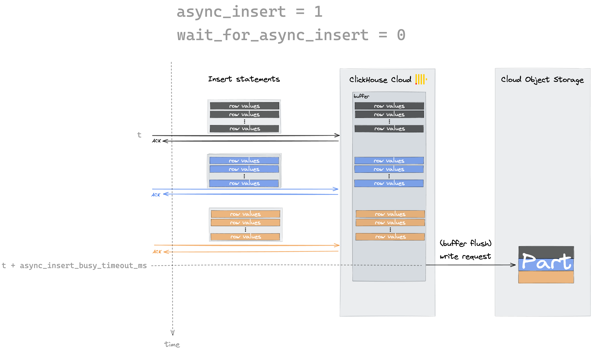
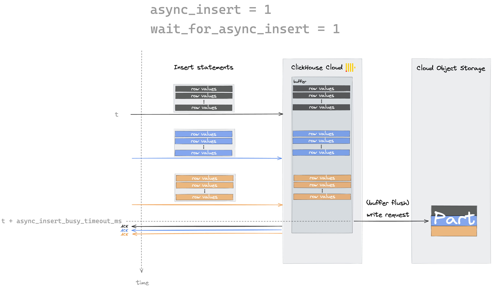

ClickHouse Cloud is using cloud object storage for your data. Write requests to object storage are more expensive than read requests. Here are some tips for minimizing the amount of write requests in ClickHouse Cloud.

## Ingest data in bulk
Batching data before writing can help reduce the number of write requests generated. As each insert creates a part together with other metadata that needs to be stored, increasing the size of each insert would reduce the number of writes required. Generally, we recommend inserting data in fairly large batches of at least 1,000 rows at a time, and ideally between 10,000 to 100,000 rows. To achieve this, consider implementing a buffer mechanism such as using Kafka in your application to enable batch inserts, or use asynchronous inserts (see [next section](#insert-data-asynchronously)).

## Insert data asynchronously

Alternatively to batching data on the client-side, you can leverage on [asynchronous inserts](https://clickhouse.com/blog/click-house-v2111-released) by enabling the [async_insert](../operations/settings/settings/#async-insert) setting and let ClickHouse handle the batching on the server-side. Doing so will also reduce the number of write requests generated.

As mentioned in the previous section, each insert sent to ClickHouse causes ClickHouse to immediately create a part containing the data from the insert. 
This is the default behavior when the async_insert setting is set to 0:

By setting async_insert to 1, ClickHouse first stores the incoming inserts into an in-memory buffer before flushing them regularly to disk. This asynchronous behavior allows ClickHouse to automatically batch your data up to 100KB (configurable via [async_insert_max_data_size](../operations/settings/settings/#async-insert-max-data-size)) or wait for 200ms (since the first insert) (configurable via [async_insert_busy_timeout_ms](../operations/settings/settings/#async-insert-max-data-size)) before writing the data to object store. This helps to reduce the amount of write requests for frequent inserts.

With the [wait_for_async_insert](../operations/settings/settings/#wait-for-async-insert) setting, you can configure if you want an insert statement to return with an acknowledgment either immediately after the data got inserted into the buffer (wait_for_async_insert = 0) or by default, after the data got written to a part after flushing from buffer (wait_for_async_insert = 1). 

The following two diagrams illustrate the two settings for async_insert and wait_for_async_insert:

Note that asynchronous insert is only applicable when inserting over HTTP protocol.

## Avoid mutations

Mutations refers to [ALTER](../sql-reference/statements/alter/) queries that manipulate table data through deletion or updates. Most notably they are queries like ALTER TABLE … DELETE, UPDATE, etc. Performing such queries will produce new mutated versions of the data parts. This means that such statements would trigger a rewrite of whole data parts for all data that was inserted before the mutation, translating to a large amount of write requests.

An alternate solution to avoid ALTER TABLE … DELETE is to use DELETE FROM, also known as [lightweight delete](../sql-reference/statements/delete). This [DELETE FROM](../sql-reference/statements/delete) query is treated as a normal update that adds a delete mask implicitly for the affected rows. Such rows will be cleaned up asynchronously in the background. Note that lightweight delete is an experimental feature at the moment.

Lightweight update, which is an optimal replacement for ALTER TABLE … UPDATE, is also in development. For now, the alternative solution to avoid such an expensive operation is to turn updates into writes by using [ReplacingMergeTree](../engines/table-engines/mergetree-family/replacingmergetree/) or [CollapsingMergeTree](../engines/table-engines/mergetree-family/collapsingmergetree/) table engine instead of the default MergeTree.

## Avoid using OPTIMIZE FINAL

Using the [OPTIMIZE TABLE ... FINAL](../sql-reference/statements/optimize/) query will initiate an unscheduled merge of data parts for the specific table into one data part. During this process, ClickHouse reads all the data parts, uncompress, merges, compresses them into a single part and then rewrite it back into object store, causing huge CPU and IO wastage. Note that this optimization rewrites the one part even if they are already merged into a single part.

## Avoid using Nullable column

[Nullable column](../sql-reference/data-types/nullable/) (e.g. Nullable(UInt8)) creates a separate column of UInt8 type. This additional column has to be processed every time when user works with a nullable column. This leads to an additional storage space used and almost always negatively affects performance.
